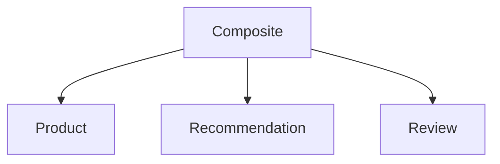

# Overview



# Build and run

```
./gradlew build 
java --enable-preview -jar api-provider/build/libs/api-provider-0.0.1-SNAPSHOT.jar &
java --enable-preview -jar api-consumer/build/libs/api-consumer-0.0.1-SNAPSHOT.jar &

curl localhost:7002/product-composite/2 -i
curl localhost:7002/thread-info

curl 'localhost:7001/1/product/1' -i
curl 'localhost:7001/1/recommendation?productId=1' -i
curl 'localhost:7001/1/review?productId=1' -i 

kill $(jobs -p)

```

# TODO

Source: https://spring.io/blog/2025/09/02/road_to_ga_introduction

## devtools

See:

1. https://docs.spring.io/spring-boot/reference/using/devtools.html
1. https://www.baeldung.com/spring-boot-devtools
1. https://stackoverflow.com/questions/79306534/intellij-spring-boot-devtools-behavior


```
dependencies {
    developmentOnly("org.springframework.boot:spring-boot-devtools")
}
```

In addition to installing spring-boot-devtools, you also need to enable automatic build in IntelliJ.

1. Open "Settings"
1. Select "Build, Execution, Deployment"
1. On the "Compiler" page, select "Build project automatically"

Also:

1. Open "Settings"
1. Select "Advanced settings"
1. In the "Compiler" section, select "Allow auto-make to start even if developed application is currently running"

## jackson 2 -> 3

T ex byta ut ObjectMapper...
Kolla användning av com.fasterxml.jackson i bokens källkod...

## versions

1. How to specify the version as a client, e.g. using RestCLient, except from adding it to the URL?
2. Interfce baesd clients?

## text based drawings in markdown

1. [Google: text based drawings in markdown](https://www.google.com/search?q=text+based+drawings+in+markdown&ie=UTF-8&oe=UTF-8&hl=sv-se&client=safari)
1. [GitHub: Creating Mermaid diagrams](https://docs.github.com/en/get-started/writing-on-github/working-with-advanced-formatting/creating-diagrams#creating-mermaid-diagrams)
2. 


## resilience

## opentelemetry

## AOT Cache in Java 25

## Null safety
