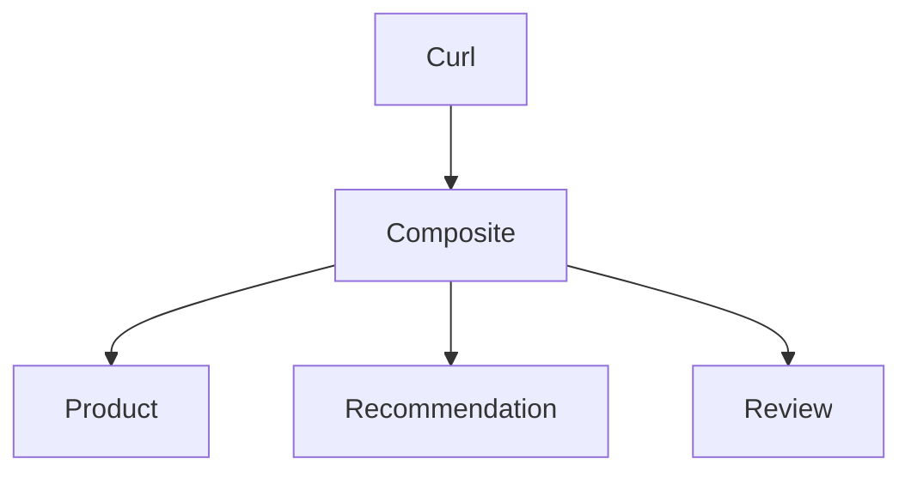

# Overview



# Start Jaeger for OpenTelemetry tracing

```
docker run -d --name jaeger \
  -p 16686:16686 \
  -p 4317:4317 \
  -p 4318:4318 \
  -p 5778:5778 \
  -p 9411:9411 \
  cr.jaegertracing.io/jaegertracing/jaeger:2.11.0
```

WebUI: http://localhost:16686

When done:

```
docker rm -f jaeger
```

Note: problem with Micrometer and Structured Consurrency:

1. Investigate Scoped Values: https://github.com/micrometer-metrics/context-propagation/issues/108
2. Discuss Structured Concurrency: https://github.com/micrometer-metrics/context-propagation/issues/419
3. micrometer observability for the new StructuredTaskScope api: https://github.com/micrometer-metrics/micrometer/issues/5761

# Build and run

```
./gradlew build 
java --enable-preview -jar api-provider/build/libs/api-provider-0.0.1-SNAPSHOT.jar &
java --enable-preview -jar api-consumer/build/libs/api-consumer-0.0.1-SNAPSHOT.jar &

curl localhost:7002/product-composite/2 -i
curl localhost:7002/thread-info

curl 'localhost:7001/1/product/1' -i
curl 'localhost:7001/1/recommendation?productId=1' -i
curl 'localhost:7001/1/review?productId=1' -i 

kill $(jobs -p)

```

# API versioning

## Provider config

```java
@Configuration
public class ApiVersionConfig implements WebMvcConfigurer {

  @Override
  public void configureApiVersioning(ApiVersionConfigurer configurer) {
    configurer
      .usePathSegment(0)  // Index of the path segment containing version
      .addSupportedVersions("1.0", "2.0")
      .setDefaultVersion("1.0");
  }
}
```

```java
@GetMapping(
value = "/{version}/product/{productId}",
version = "1",
produces = "application/json")
Product getProduct(@PathVariable int productId);
```

## Consumer config, RestClient

```java
  @Bean
  RestClient restClient() {
    return RestClient.builder().
      apiVersionInserter(ApiVersionInserter.usePathSegment(0)).
      build();
  }
```

```java
      Product product = restClient.get()
        .uri(url)
        .apiVersion("1")
        ...
```

## Consumer config, with HttpServiceProxyFactory

Can't get it to work, see `ProductCompositeIntegrationWithProxies`
Maybe problem with apiVersionInserter...

# Resilience

## FaultRate

```
curl 'http://localhost:7001/1/faultrate?probability=75' -X PUT
curl http://localhost:7001/1/faultrate
```

## Retryable

## CircuitBreaker

## ConcurrencyLimit

# Spring Dev Tools

See:

1. https://docs.spring.io/spring-boot/reference/using/devtools.html
1. https://www.baeldung.com/spring-boot-devtools
1. https://stackoverflow.com/questions/79306534/intellij-spring-boot-devtools-behavior


```
dependencies {
    developmentOnly("org.springframework.boot:spring-boot-devtools")
}
```

In addition to installing spring-boot-devtools, you also need to enable automatic build in IntelliJ.

1. Open "Settings"
1. Select "Build, Execution, Deployment"
1. On the "Compiler" page, select "Build project automatically"

Also:

1. Open "Settings"
1. Select "Advanced settings"
1. In the "Compiler" section, select "Allow auto-make to start even if developed application is currently running"


# TODO

Source: https://spring.io/blog/2025/09/02/road_to_ga_introduction

## jackson 2 -> 3

T ex byta ut ObjectMapper...
Kolla användning av com.fasterxml.jackson i bokens källkod...

## resilience

## opentelemetry

## AOT Cache in Java 25

## Null safety
